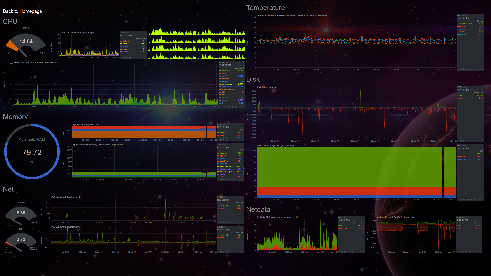

# NetData Dashboard

This uses [NetData](https://github.com/firehol/netdata), and specifically it
uses the most recent git version.

[Here's the official wiki
page](https://github.com/firehol/netdata/wiki/Custom-Dashboards) on creating
custom dashboards.

## Install 

I'm on Arch Linux, so this is easy to install

```bash
┬─[william@fillory:~]
╰─>$ pacaur -S netdata-git
┬─[william@fillory:~]
╰─>$ sudo systemctl enable netdata.service
┬─[william@fillory:~]
╰─>$ sudo systemctl start netdata.service
```

You can install my version by cloning this repository, and assuming you have
installed via Arch Linux (or at least put the right things in the right spot)
running the `install.sh` script.

```bash
┬─[william@fillory:~]─[11:46:38 PM]
╰─>$ ./install.sh
```

Under the hood, this is just copying things in the right spot and restarting
NetData. (I know it's not the best install script, but ehh, whatever.)

```
sudo cp ./custom.html /usr/share/netdata/web/custom.html
sudo chown netdata /usr/share/netdata/web/custom.html
sudo chgrp netdata /usr/share/netdata/web/custom.html
sudo cp ./netdata.conf /etc/netdata/netdata.conf
sudo cp ./apps_groups.conf /etc/netdata/apps_groups.conf
sudo systemctl restart netdata.service
```

## Custom Dashboard

Here's what my version looks like for personal use.



## Custom Dashbord 2
This is another dashboard that works well on server instances.


## Specific Modifications

* Added new applications to be logged.

```
browser: firefox* *chrome*
python: python*
email: thunderbird
dropbox: dropbox*
```

* Setup new dashboard layout.
* `netdata.conf` is currently default, but this may change in the future.

## Notes

* [Here's documentation on `valuerange`](https://github.com/firehol/netdata/issues/832)

## TODO

* Main CPU graph - remove labels (they're useless)
* GPU
* Battery
* Active when not focused
* Health Checks
    * Disk Writes
    * Temp
    * Battery
